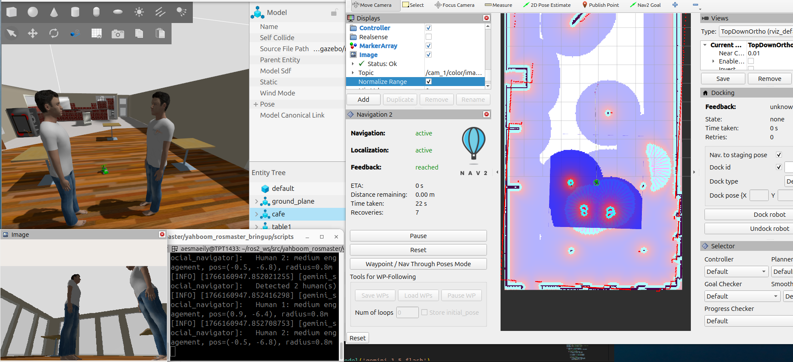

# yahboom_rosmaster #

This repository extends the base Automatic Addison setup for the ROSMASTER X3 robot by Yahboom. It has been significantly modified to support social navigation research, with changes across multiple components:

Nav2 configuration files — tuned for human‑aware navigation and social interaction scenarios.

Gazebo world files — updated to simulate environments where social navigation can be tested.

Foundation model integration — added modules and hooks to connect large‑scale AI models for perception and planning.

The goal of these edits is to provide a robust platform for experimenting with ROS 2 social navigation, combining the standard navigation stack with modern AI approaches.

