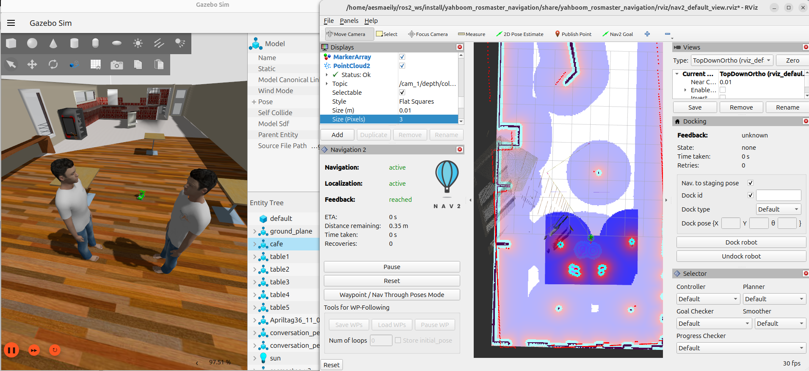

# Yahboom ROSMASTER X3 - Social Navigation Platform




---

## Overview

This repository extends the base [Automatic Addison](https://automaticaddison.com) setup for the **ROSMASTER X3** robot by Yahboom. It has been significantly modified to support **social navigation research**, implementing a **Hybrid Tracker** that combines Generative AI with kinematic physics to solve human tracking issues.

### Key Modifications

| Component | Changes |
|-----------|---------|
| **Nav2 Configuration** | Tuned for human-aware navigation with virtual obstacle support |
| **Gazebo World Files** | Updated with human models for social interaction scenarios |
| **Foundation Model Integration** | Added Gemini AI modules for human detection and engagement analysis |
| **Hybrid Tracker** | Implemented Velocity Clamping and Exponential Smoothing to eliminate "ghosting" |

### Core Scripts

To support both research environments, the logic is split into two specialized scripts:

1. **`social_navigation_hybridsim.py`**: Optimized for **Gazebo Simulation**. It handles TF transforms relative to the simulation `map` frame and synchronizes with simulated camera clocks.

2. **`social_navigation_hybridreal.py`**: Optimized for **Real-World Hardware**. It includes specific handling for the **Intel RealSense D435** drivers, manages real-world sensor noise, and handles the `camera_color_optical_frame` transforms directly.

---

## Quick Start

### Prerequisites

```bash
# Install dependencies
sudo apt update
sudo apt install ros-jazzy-navigation2 ros-jazzy-nav2-bringup ros-jazzy-realsense2-camera

# Python dependencies for Gemini AI
pip install google-generativeai opencv-python pillow numpy --break-system-packages
```

### Setup Aliases (Recommended)

Add these aliases to your `~/.bashrc` for quick access:

```bash
# Navigation aliases for simulation Gazebo
alias nav1='bash /home/aesmaeily/ros2_ws/src/yahboom_rosmaster/yahboom_rosmaster_bringup/scripts/rosmaster_x3_navigation.sh'

# Social navigation with Gemini AI (Hybrid Tracker), can you run either simultion or real
alias social_nav='bash /home/aesmaeily/ros2_ws/src/yahboom_rosmaster/yahboom_rosmaster_bringup/scripts/launch_gemini_detector.sh'

# Source ROS2 workspace
alias srcros='source /home/aesmaeily/ros2_ws/install/setup.bash'
```

Then reload:

```bash
source ~/.bashrc
```

---

## Running the System

You can run the system in two modes: **Simulation** or **Real-World**.

### Mode 1: Simulation (Gazebo)

Use this mode for testing logic and navigation behavior in a safe virtual environment.

**Terminal 1: Launch Simulation & Nav2**
```bash
nav_sim
# Launches Gazebo, Robot State Publisher, Nav2, and RViz
```

**Terminal 2: Launch Social Tracker (Sim)**
```bash
# Ensure your API Key is set
export GEMINI_API_KEY="AIzaSy...YOUR_KEY"

# Run the Simulation Script
ros2 run yahboom_rosmaster_navigation social_navigation_hybridsim.py
```

### Mode 2: Real-World (Hardware)

Use this mode when connected to the physical ROSMASTER X3 robot with the Intel RealSense D435 camera.

**Terminal 1: Launch Camera Drivers**

Start the RealSense camera with pointclouds enabled.
```bash
ros2 launch realsense2_camera rs_launch.py align_depth.enable:=true pointcloud.enable:=true
```

**Terminal 2: Launch Real-World Tracker**
```bash
# Ensure your API Key is set
export GEMINI_API_KEY="AIzaSy...YOUR_KEY"

# Run the Real-World Script
ros2 run yahboom_rosmaster_navigation social_navigation_hybridreal.py
```

**Terminal 3: Visualization (Optional)**
```bash
ros2 run rviz2 rviz2
# Set Fixed Frame to: camera_color_optical_frame
# Add MarkerArray topic: /human_markers
# Add PointCloud2 topic: /virtual_obstacles
```

## Social Navigation Features

### Human Detection with Gemini AI

The system uses Google's Gemini foundation model to:

1. **Detect humans** in camera images (Visual Backup)
2. **Assess engagement level** (conversation, standing, walking)
3. **Track positions** using the Hybrid Algorithm below

### Engagement-Based Navigation

| Engagement Level | Human Activity | Obstacle Radius | Robot Behavior |
|------------------|----------------|-----------------|----------------|
| **HIGH** | Conversation, interacting | 0.85m | Wide detour - don't interrupt |
| **MEDIUM** | Standing, looking around | 0.60m | Moderate buffer |
| **LOW** | Walking, passing through | 0.35m | Can pass closer |

### Sample Output

When running the social navigation node, you'll see real-time detection logs:

```
[INFO] [social_navigator_hybrid]: Human 1: MEDIUM -> 0.56m [DEPTH_SENSOR]
[INFO] [social_navigator_hybrid]: Human 2: HIGH -> 0.79m [VISUAL_BACKUP (Ghost)]
[INFO] [social_navigator_hybrid]: Human 1: MEDIUM -> 0.57m [DEPTH_SENSOR]
[INFO] [social_navigator_hybrid]: Human 2: MEDIUM -> 0.65m [VISUAL_BACKUP (Ghost)]
[INFO] [social_navigator_hybrid]: Human 1: MEDIUM -> 0.57m [DEPTH_SENSOR]
[INFO] [social_navigator_hybrid]: Human 2: MEDIUM -> 0.78m [VISUAL_BACKUP (Ghost)]
```

**Log Format:** `Human [ID]: [ENGAGEMENT] -> [RADIUS] [SOURCE]`

| Field | Description |
|-------|-------------|
| `Human 1/2` | Detected person ID |
| `HIGH/MEDIUM/LOW` | Engagement level (affects obstacle size) |
| `0.57m` | Virtual obstacle radius |
| `DEPTH_SENSOR` | Distance from depth camera (accurate) |
| `VISUAL_BACKUP (Ghost)` | Fallback to Gemini estimate (less accurate) |

---

## Algorithm Mathematics (The Hybrid Tracker)

To solve the "Ghosting" and "Jitter" problems inherent in visual detection, we implemented a physics-based filtering pipeline.

### 1. Velocity Clamping (Anti-Teleportation)

This limits the maximum distance an object can travel in a single time step, preventing impossible jumps caused by sensor noise.

**Variables:**

- `P_old`: Previous position vector
- `P_new`: Raw position measured by the sensor
- `d_max`: Maximum allowed distance per step (e.g., `0.5m`)

**Step 1: Calculate Displacement**

$$\Delta \mathbf{P} = \mathbf{P}_{new} - \mathbf{P}_{old}$$

**Step 2: Calculate Magnitude**

$$d = |\Delta \mathbf{P}| = \sqrt{(x_{new} - x_{old})^2 + (y_{new} - y_{old})^2}$$

**Step 3: Apply Clamp**

If the distance `d` exceeds the limit `d_max`, we scale the vector back.

$$\mathbf{P}_{clamped} = \begin{cases} \mathbf{P}_{new} & \text{if } d \le d_{max} \\ \mathbf{P}_{old} + \left( \frac{\Delta \mathbf{P}}{d} \times d_{max} \right) & \text{if } d > d_{max} \end{cases}$$

### 2. Exponential Smoothing (Low-Pass Filter)

This filters out high-frequency noise (jitter) by blending the current state with the new input.

**Variables:**

- `P_t`: Final smoothed position at time `t`
- `P_input`: The input for this step (from Clamping)
- `α`: Smoothing factor (`0 < α ≤ 1`)

**The Formula:**

$$\mathbf{P}_{t} = \alpha \cdot \mathbf{P}_{input} + (1 - \alpha) \cdot \mathbf{P}_{t-1}$$

### 3. The Combined Algorithm

In the `social_navigation_hybrid.py` node, these apply sequentially:

$$\mathbf{P}_{final} = \underbrace{\alpha \cdot \left[ \mathbf{P}_{old} + \min\left(1, \frac{d_{max}}{|\mathbf{P}_{sensor} - \mathbf{P}_{old}|} \right) (\mathbf{P}_{sensor} - \mathbf{P}_{old}) \right]}_{\text{New Contribution}} + \underbrace{(1 - \alpha) \cdot \mathbf{P}_{old}}_{\text{History Inertia}}$$

---

## Configuration

### Camera Settings

Camera settings affect both detection quality and system performance. Edit in `rosmaster_x3.urdf.xacro`:

```xml
<xacro:rgbd_camera
  xyz_offset="0.105 0 0.05"
  rpy_offset="0 0.1 0"/>
```

| Parameter | Recommended | Description |
|-----------|-------------|-------------|
| `image_width` | 640 | Image width in pixels |
| `image_height` | 480 | Image height in pixels |
| `update_rate` | 5 | Frames per second |
| `clip_far` | 8.0 | Maximum detection range (meters) |

### Nav2 Virtual Obstacles Configuration

Ensure your `nav2_params.yaml` has virtual obstacles configured:

```yaml
obstacle_layer:
  plugin: "nav2_costmap_2d::ObstacleLayer"
  observation_sources: scan virtual_obstacles
  scan:
    topic: /scan
    # ... scan params ...
  virtual_obstacles:              # Must be INSIDE obstacle_layer!
    topic: /virtual_obstacles
    data_type: "PointCloud2"
    marking: true
    clearing: false
    min_obstacle_height: 0.0
    max_obstacle_height: 2.0
```

---

## Environment Variables

Add to `~/.bashrc`:

```bash
# Gazebo model path (required for cafe world)
export GZ_SIM_RESOURCE_PATH=/home/aesmaeily/ros2_ws/src/yahboom_rosmaster/yahboom_rosmaster_gazebo/models:$GZ_SIM_RESOURCE_PATH

# ROS2 workspace
source /home/aesmaeily/ros2_ws/install/setup.bash
```

---

## Troubleshooting

| Problem | Solution |
|---------|----------|
| **Robot sees ghosts (Double Obstacles)** | Ensure you are running `social_navigation_hybridsim.py` or `social_navigation_hybridreal.py`, not the old version |
| **Virtual obstacles not appearing** | Check Nav2 config indentation - `virtual_obstacles` must be inside `obstacle_layer` |
| **Camera looking at ceiling** | Change `rpy_offset` to `"0 0.1 0"` in URDF |
| **Robot unstable in RViz** | Reduce camera `update_rate` to 5 Hz |
| **Gemini API errors** | Verify `export GEMINI_API_KEY` is set in the launch script |
| **RealSense not detected** | Check USB connection, run `rs-enumerate-devices` |

---

## Documentation

| Document | Description |
|----------|-------------|
| [Navigation README](yahboom_rosmaster_navigation/README.md) | Virtual obstacles and social navigation guide |
| [Troubleshooting Report](yahboom_rosmaster_navigation/TROUBLESHOOTING_REPORT.md) | Common issues and solutions |
| [Supervisor Report](yahboom_rosmaster_navigation/SUPERVISOR_REPORT.md) | Technical details for academic review |

---

## Credits

- **Base Setup:** [Automatic Addison](https://automaticaddison.com) - ROSMASTER X3 ROS 2 tutorials
- **Robot Hardware:** [Yahboom](https://www.yahboom.net/) - ROSMASTER X3 robot platform
- **AI Integration:** Google Gemini API for human detection and engagement analysis
- **Algorithm Design:** Abolghasem Esmaeily

---

## Author

**Abolghasem Esmaeily**  
Social Navigation Research   
February 2026