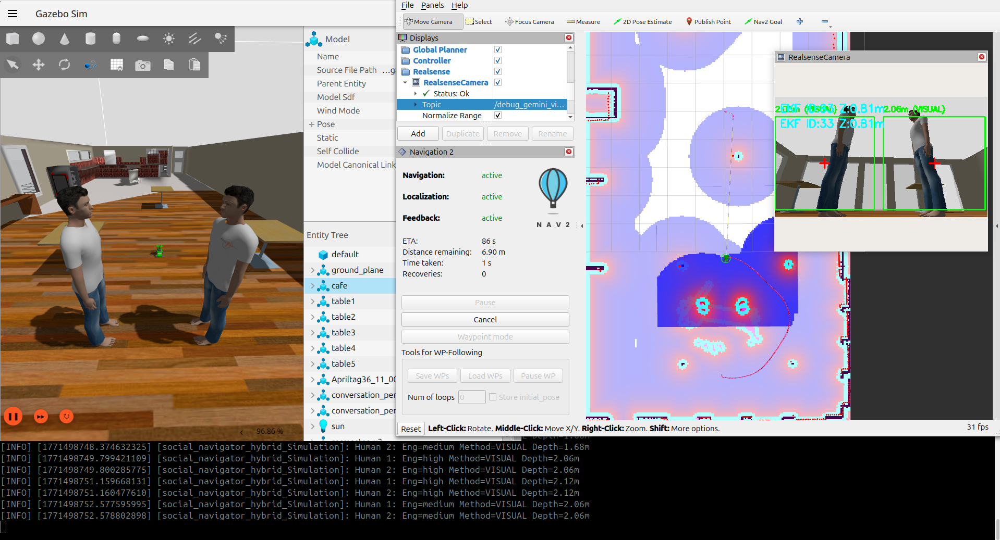
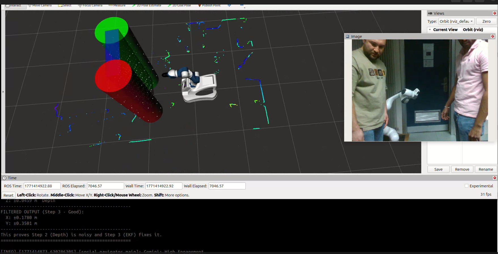
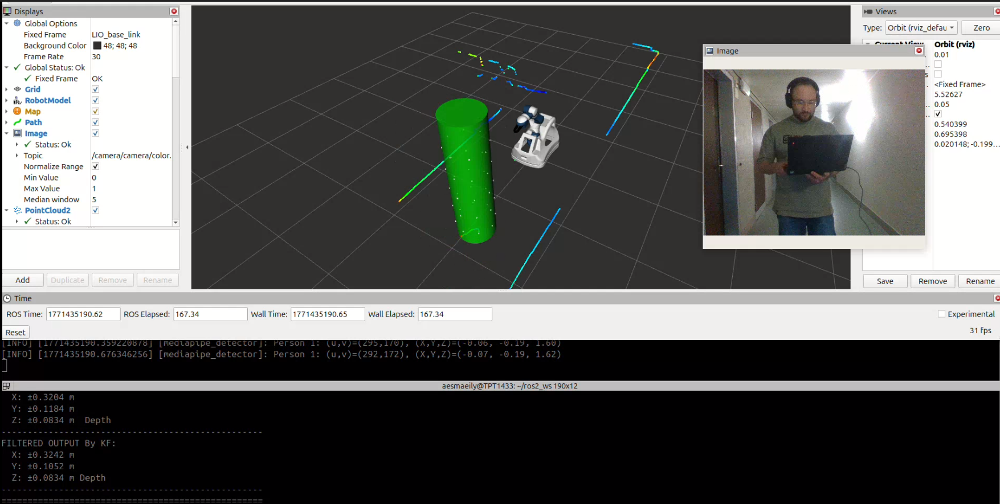
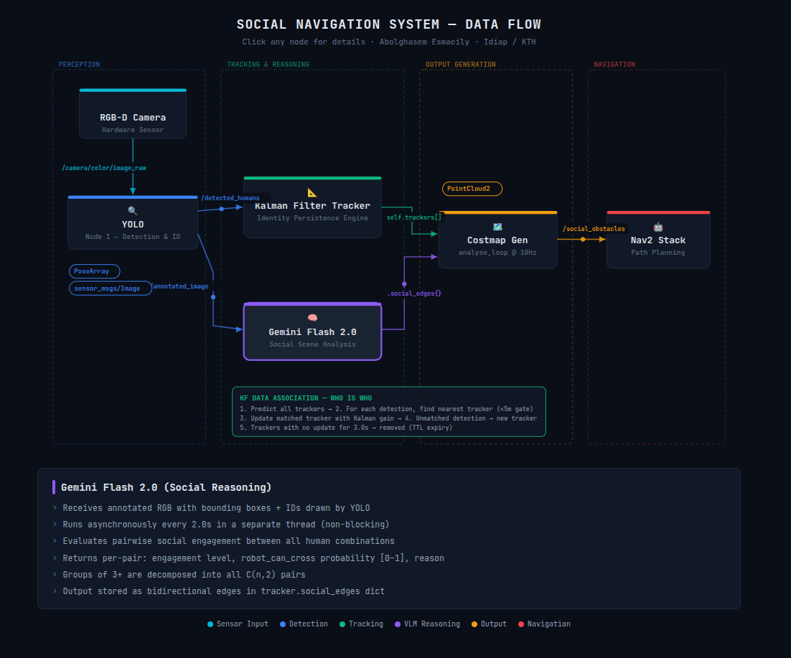

# Yahboom ROSMASTER X3 - Social Navigation Platform






---

## System Architecture

> [**Open Interactive Architecture Diagram**](https://abolghasem28.github.io/Social_navigation/architecture.html) — click any node for technical details



---

## Overview

This repository extends the base [Automatic Addison](https://automaticaddison.com) setup for the **ROSMASTER X3** robot by Yahboom. It has been significantly modified to support **social navigation research**, implementing a **KF-based Hybrid Tracker** that combines Generative AI with probabilistic state estimation to solve human tracking issues.

### Key Modifications

| Component | Changes |
|-----------|---------|
| **Nav2 Configuration** | Tuned for human-aware navigation with virtual obstacle support |
| **Perception Pipeline** | YOLO11n-pose for robust, multi-person 3D shoulder landmark extraction |
| **Foundation Model Integration** | Gemini Flash 2.0 for social engagement analysis and scene understanding |
| **KF Hybrid Tracker** | Kalman Filter with nearest-neighbor data association for robust tracking |

### Core Scripts

The logic is split into specialized scripts to support both research environments:

1. **`social_navigation_hybridsim.py`**: Optimized for **Gazebo Simulation**. Uses Kalman Filter for tracking. Handles TF transforms relative to the simulation `map` frame and synchronizes with simulated camera clocks. **Note:** Still exhibits jittering and ghosting — KF reduces noise but is not perfect.

2. **`social_navigation_hybridreal.py`**: Optimized for **Real-World Hardware**. Uses Kalman Filter for tracking. Includes specific handling for the **Intel RealSense D435** drivers, manages real-world sensor noise (mm → m conversion), and handles the `camera_color_optical_frame` transforms directly. **Note:** Still exhibits jittering and ghosting — can be dangerous in real-world scenarios.

3. **`yolo_detector.py` + `social_navigation.py`**: **Most Robust Solution**. Uses **YOLO11n-pose** for human pose estimation. Detects left and right shoulder landmarks to provide accurate keypoints, assigns persistent IDs via left-to-right spatial ordering, and publishes both a PoseArray and an annotated image with bounding boxes and IDs. The Kalman Filter in `social_navigation.py` then tracks these detections over time while Gemini Flash 2.0 evaluates social boundaries. This approach **eliminates jitter and ghost obstacles** that persist with the KF-only methods. **Requires Conda environment.**

---

## Quick Start

### Prerequisites
```bash
# Install dependencies
sudo apt update
sudo apt install ros-jazzy-navigation2 ros-jazzy-nav2-bringup ros-jazzy-realsense2-camera

# Python dependencies for Gemini AI
pip install google-generativeai opencv-python pillow numpy --break-system-packages

# YOLO dependencies (inside conda environment)
conda activate YOUR_ENV
pip install ultralytics
```

### Setup Aliases (Recommended)

Add these aliases to your `~/.bashrc` for quick access:
```bash
# Navigation aliases for simulation Gazebo
alias nav1='bash /home/<user>/ros2_ws/src/yahboom_rosmaster/yahboom_rosmaster_bringup/scripts/rosmaster_x3_navigation.sh'

# Social navigation with Gemini AI (KF Hybrid Tracker)
alias social_nav='bash /home/<user>/ros2_ws/src/yahboom_rosmaster/yahboom_rosmaster_bringup/scripts/launch_gemini_detector.sh'

# Source ROS2 workspace
alias srcros='source /home/<user>/ros2_ws/install/setup.bash'
```

Then reload:
```bash
source ~/.bashrc
```

---

## Running the System

You can run the system in three modes: **Simulation**, **Real-World (KF)**, or **Real-World (YOLO Pose)**.

### Mode 1: Simulation (Gazebo)

Use this mode for testing logic and navigation behavior in a safe virtual environment.

**Terminal 1: Launch Simulation & Nav2**
```bash
nav_sim
# Launches Gazebo, Robot State Publisher, Nav2, and RViz
```

**Terminal 2: Launch Social Tracker (Sim)**
```bash
# Ensure your API Key is set
export GEMINI_API_KEY="AIzaSy...YOUR_KEY"

# Run the Simulation Script (uses Kalman Filter)
ros2 run yahboom_rosmaster_navigation social_navigation_hybridsim.py
```

> ⚠️ **Note:** The simulation script uses Kalman Filter. You may still observe jittering and ghosting — KF reduces noise but is not perfect.

### Mode 2: Real-World (KF-based)

Use this mode when connected to the physical robot with the Intel RealSense D435 camera.

**Terminal 1: Launch Camera Drivers**

Start the RealSense camera with pointclouds enabled.
```bash
ros2 launch realsense2_camera rs_launch.py align_depth.enable:=true pointcloud.enable:=true
```

**Terminal 2: Launch Real-World Tracker**
```bash
# Ensure your API Key is set
export GEMINI_API_KEY="AIzaSy...YOUR_KEY"

# Run the Real-World Script (uses Kalman Filter)
ros2 run yahboom_rosmaster_navigation social_navigation_hybridreal.py
```

> ⚠️ **Warning:** This method still exhibits jittering and ghosting, which can be **dangerous** in real-world scenarios. Consider using YOLO Pose mode below for robust tracking.

**Terminal 3: Visualization (Optional)**
```bash
ros2 run rviz2 rviz2
# Set Fixed Frame to: camera_color_optical_frame
# Add MarkerArray topic: /human_markers
# Add PointCloud2 topic: /social_obstacles
```

### Mode 3: Real-World (YOLO Pose — Recommended)

This is the **most robust solution** that eliminates jitter and ghost obstacles. It uses YOLO11n-pose to detect left and right shoulder landmarks, providing accurate keypoints for human localization.

> ⚠️ **Important:** The Conda environment must be active when running the YOLO detector. YOLO depends on `ultralytics` and other packages installed inside the Conda environment.

**Terminal 1: Launch Camera Drivers**
```bash
ros2 launch realsense2_camera rs_launch.py pointcloud.enable:=true align_depth.enable:=true
```

**Terminal 2: Static TF Transforms**

Publish the required TF transforms between the robot base and camera frames:
```bash
# Terminal 2a: Gripper to camera transform
ros2 run tf2_ros static_transform_publisher -0.10 0 0.052 0 -1.5708 0 lio_gripper_interface_link camera_link

# Terminal 2b: Base to camera transform
ros2 run tf2_ros static_transform_publisher 0 0 0.5 0 0 0 LIO_base_link camera_link
```

**Terminal 3: Launch YOLO Detector (Conda required)**
```bash
# Activate Conda environment — required for YOLO
conda activate YOUR_ENV

# Run YOLO detector (Node 1)
python3 yolo_detector.py
```

> This publishes `/detected_humans` (PoseArray) and `/annotated_image` (sensor_msgs/Image with bounding boxes and IDs).

**Terminal 4: Launch Social Navigation**
```bash
# Ensure your API Key is set
export GEMINI_API_KEY="AIzaSy...YOUR_KEY"

# Run social navigation (Node 2)
python3 social_navigation.py
```

> 💡 **Tip:** You can also set the API key in the `social_navigation.py` file directly or in `launch_gemini_detector.sh` under `yahboom_rosmaster_bringup`.

---

## Social Navigation Features

### Human Detection with YOLO Pose

The perception pipeline uses **YOLO11n-pose** to:

1. **Detect humans** in camera images with bounding boxes
2. **Extract shoulder landmarks** — left and right shoulder keypoints for precise 3D localization
3. **Assign persistent IDs** via left-to-right spatial ordering
4. **Publish detections** as PoseArray (3D positions) and annotated images with IDs

### Social Reasoning with Gemini Flash 2.0

The system uses Google's **Gemini Flash 2.0** foundation model to:

1. **Analyze annotated images** with bounding boxes and human IDs from YOLO
2. **Evaluate pairwise social engagement** between all human combinations — groups of 3+ are decomposed into all C(n,2) pairs
3. **Return per-pair data**: engagement level, `robot_can_cross` probability [0–1], and a reason
4. **Store results** as bidirectional edges in the tracker's `social_edges` dictionary

### Costmap Generation

The `analyse_loop` runs at 10Hz and:

1. **Rebuilds the entire PointCloud2** from scratch every cycle — no stale data accumulation in the node
2. **Generates obstacle cylinders** (r=0.25m, h=1.4m, 40 points) around each tracked human
3. **Creates social walls** between blocked pairs (`can_cross < 0.5`) as dense obstacle points
4. **Publishes to `/social_obstacles`** (PointCloud2) consumed by Nav2's costmap

### Sample Output

When running the social navigation node, you'll see real-time detection logs:
```
[INFO] [social_navigator_main]: Mapped Pair [0, 1] | Can Cross: 0.15 | Reason: Active conversation
[INFO] [social_navigator_main]: Edge [0-1] | Cross Prob: 0.15 | Reason: Active conversation
```

---

## Algorithm: KF Hybrid Tracker

The tracking system evolved through four iterations, each solving specific problems:

| Version | Method | Problem Solved | Remaining Issue |
|---------|--------|----------------|-----------------|
| V1 | Velocity Clamping + Low-Pass Filter | Reduced teleportation jumps | Jitter and ghosting persisted |
| V2 | V1 + Hit Threshold | Eliminated ghost obstacles | 2s delay before new detections appear |
| V3 | Kalman Filter + Mahalanobis | Probabilistic smoothing + motion prediction | Jitter and ghosting reduced but still present — can be dangerous |
| **V4 (Current)** | **YOLO Pose + KF + Gemini** | **ML-based shoulder keypoints** | **None — most robust solution** |

### Why Kalman Filter?

The fundamental problem is that per-frame analysis produces **non-deterministic measurements**: the same person in the same position yields slightly different bounding boxes each frame due to pixel-level variations in color and illumination. Combined with noisy depth sensor data, this causes obstacle positions to jitter and ghost.

The Kalman Filter addresses both issues:
1. **Process noise** models frame-to-frame variation
2. **Measurement noise** models the depth sensor uncertainty
3. **State prediction** enables smooth obstacle movement between detection frames

A Particle Filter was considered but rejected due to computational cost — Gemini already introduces latency (~1–2s per frame), and particle filtering on a laptop CPU would compound this significantly.

### Why YOLO Pose is Better

While KF reduces noise, it cannot eliminate jitter caused by **fundamentally noisy bounding box center detections**. YOLO11n-pose provides:

- **Anatomical keypoints** (shoulders) instead of bounding box centers
- **Sub-pixel accuracy** from trained neural networks
- **Temporal consistency** built into the pose estimation model

---

### 1. Kalman Filter State Model

Each tracked human is modeled with a **constant-velocity state vector**:

$$\mathbf{x} = \begin{bmatrix} x \\ y \\ v_x \\ v_y \end{bmatrix}$$

where $(x, y)$ is the position in the robot base frame and $(v_x, v_y)$ is the estimated velocity.

#### Prediction Step

The state transition follows a constant-velocity model:

$$\mathbf{x}_{k|k-1} = \mathbf{A} \cdot \mathbf{x}_{k-1|k-1}$$

$$\mathbf{A} = \begin{bmatrix} 1 & 0 & \Delta t & 0 \\ 0 & 1 & 0 & \Delta t \\ 0 & 0 & 1 & 0 \\ 0 & 0 & 0 & 1 \end{bmatrix}$$

with $\Delta t = 0.1\text{s}$.

The predicted covariance:

$$\mathbf{P}_{k|k-1} = \mathbf{A} \cdot \mathbf{P}_{k-1|k-1} \cdot \mathbf{A}^T + \mathbf{Q}$$

where:

$$\mathbf{Q} = \begin{bmatrix} 0.05 & 0 & 0 & 0 \\ 0 & 0.05 & 0 & 0 \\ 0 & 0 & 0.1 & 0 \\ 0 & 0 & 0 & 0.1 \end{bmatrix}$$

The higher process noise on velocity $(0.1)$ versus position $(0.05)$ reflects that velocity changes are expected between frames (people start and stop), while position should evolve smoothly.

A **velocity friction factor** of $0.95$ is applied after each prediction to bias stationary humans toward zero velocity:

$$v_x \leftarrow 0.95 \cdot v_x, \quad v_y \leftarrow 0.95 \cdot v_y$$

#### Update Step

When a new YOLO detection arrives, the measurement is the position in the robot base frame:

$$\mathbf{z}_k = \begin{bmatrix} x_{measured} \\ y_{measured} \end{bmatrix}$$

The measurement matrix extracts position from the state:

$$\mathbf{H} = \begin{bmatrix} 1 & 0 & 0 & 0 \\ 0 & 1 & 0 & 0 \end{bmatrix}$$

**Innovation** (difference between measurement and prediction):

$$\mathbf{y}_k = \mathbf{z}_k - \mathbf{H} \cdot \mathbf{x}_{k|k-1}$$

**Innovation covariance**:

$$\mathbf{S}_k = \mathbf{H} \cdot \mathbf{P}_{k|k-1} \cdot \mathbf{H}^T + \mathbf{R}$$

where $\mathbf{R} = \mathbf{I}_2 \cdot 0.5$ represents the measurement noise. The value $R = 0.5$ indicates moderate camera trust.

**Kalman Gain**:

$$\mathbf{K}_k = \mathbf{P}_{k|k-1} \cdot \mathbf{H}^T \cdot \mathbf{S}_k^{-1}$$

**State update**:

$$\mathbf{x}_{k|k} = \mathbf{x}_{k|k-1} + \mathbf{K}_k \cdot \mathbf{y}_k$$

**Covariance update**:

$$\mathbf{P}_{k|k} = (\mathbf{I}_4 - \mathbf{K}_k \cdot \mathbf{H}) \cdot \mathbf{P}_{k|k-1}$$

#### Z-Axis (Depth) Handling

The depth coordinate is updated directly when a new measurement arrives, since vertical motion is not modeled by the 2D Kalman Filter:

$$z_t = z_{measured}$$

---

### 2. Data Association

A critical component is **matching new detections to existing tracks**. The system uses **nearest-neighbor association** with a distance gate of 5.0m and a used-tracker exclusion set to prevent two detections from claiming the same identity.

#### Association Algorithm

```
1. PREDICT all existing trackers
2. FOR each new detection:
     Find the nearest unmatched tracker within the 5m gate
     IF found → UPDATE that tracker with the measurement
     ELSE → CREATE a new tracker
3. REMOVE trackers with no update for 3.0s (TTL expiry)
```

#### Implementation
```python
used_trackers = set()
for det in detections:
    best_t = None
    min_dist = 5.0

    for t in self.trackers:
        if t in used_trackers:
            continue
        dist = math.sqrt((t.state[0, 0]-det['x'])**2 + (t.state[1, 0]-det['y'])**2)
        if dist < min_dist:
            min_dist = dist
            best_t = t

    if best_t:
        best_t.update(det['x'], det['y'], det['z'])
        used_trackers.add(best_t)
    else:
        self.trackers.append(HumanTracker(det['x'], det['y'], det['z']))
```

---

### 3. Legacy Methods (V1–V2 — Retained as Fallback)

The original Velocity Clamping and Exponential Smoothing methods are retained in the simulation script as a simpler alternative.

#### Velocity Clamping (Anti-Teleportation)

Limits the maximum displacement per time step to prevent impossible jumps:

$$\mathbf{P}_{clamped} = \begin{cases} \mathbf{P}_{new} & \text{if } d \le d_{max} \\ \mathbf{P}_{old} + \frac{\Delta \mathbf{P}}{|\Delta \mathbf{P}|} \cdot d_{max} & \text{if } d > d_{max} \end{cases}$$

where $d = |\mathbf{P}_{new} - \mathbf{P}_{old}|$ and $d_{max} = 0.3\text{m}$.

#### Exponential Smoothing (Low-Pass Filter)

Blends the current measurement with the previous state:

$$\mathbf{P}_{t} = \alpha \cdot \mathbf{P}_{input} + (1 - \alpha) \cdot \mathbf{P}_{t-1}$$

where $\alpha = 0.2$.

#### Combined Legacy Formula

$$\mathbf{P}_{final} = \alpha \cdot \left[ \mathbf{P}_{old} + \min\left(1, \frac{d_{max}}{|\mathbf{P}_{sensor} - \mathbf{P}_{old}|} \right) (\mathbf{P}_{sensor} - \mathbf{P}_{old}) \right] + (1 - \alpha) \cdot \mathbf{P}_{old}$$

---

### 4. Mahalanobis Distance (V3 — Retained in hybridreal/hybridsim)

The V3 scripts (`social_navigation_hybridreal.py` and `social_navigation_hybridsim.py`) use **Mahalanobis distance** for data association instead of Euclidean distance. This weights the residual by the inverse of the innovation covariance, providing adaptive elliptical gating.

#### The Formula

For a detection $\mathbf{z}$ and a track with predicted state $\mathbf{x}$:

$$d^2_M = \mathbf{y}^T \cdot \mathbf{S}^{-1} \cdot \mathbf{y}$$

where:
- $\mathbf{y} = \mathbf{z} - \mathbf{H} \cdot \mathbf{x}$ is the innovation residual
- $\mathbf{S} = \mathbf{H} \cdot \mathbf{P} \cdot \mathbf{H}^T + \mathbf{R}$ is the innovation covariance

#### Chi-Squared Gating

Under the assumption that the innovation is Gaussian, $d^2_M$ follows a **chi-squared distribution** with 2 degrees of freedom. A **99% confidence gate** is applied:

$$d^2_M < \chi^2_{2, 0.99} = 9.21$$

| Confidence Level | $\chi^2$ Threshold (2 DOF) | Meaning |
|------------------|---------------------------|---------|
| 95% | 5.99 | Tighter gate — may miss valid associations |
| **99%** | **9.21** | **Used in V3 — good balance** |
| 99.5% | 10.60 | Looser gate — may allow false associations |

---

## Configuration

### Camera Settings

Camera settings affect both detection quality and system performance. Edit in `rosmaster_x3.urdf.xacro`:
```xml
<xacro:rgbd_camera
  xyz_offset="0.105 0 0.05"
  rpy_offset="0 0.1 0"/>
```

| Parameter | Recommended | Description |
|-----------|-------------|-------------|
| `image_width` | 640 | Image width in pixels |
| `image_height` | 480 | Image height in pixels |
| `update_rate` | 5 | Frames per second |
| `clip_far` | 8.0 | Maximum detection range (meters) |

### Nav2 Virtual Obstacles Configuration

Ensure your `nav2_params.yaml` has virtual obstacles configured:
```yaml
obstacle_layer:
  plugin: "nav2_costmap_2d::ObstacleLayer"
  observation_sources: scan social_obstacles
  scan:
    topic: /scan
    # ... scan params ...
  social_obstacles:
    topic: /social_obstacles
    data_type: "PointCloud2"
    marking: true
    clearing: false
    min_obstacle_height: 0.0
    max_obstacle_height: 2.0
```

> ⚠️ **Known Issue:** With `clearing: false`, costmap cells persist even after the node stops publishing points at those locations. For production use, a dedicated costmap layer plugin with built-in cell timeout is recommended.

> ⚠️ **Lio Platform Note:** Nav2 only allows observation sources to be declared at startup from config files, not at runtime. On Lio, which uses dynamic config generation from sensor YAML files, company-side access is required to add the `social_obstacles` observation source.

---

## Environment Variables

Add to `~/.bashrc`:
```bash
# Gazebo model path (required for cafe world)
export GZ_SIM_RESOURCE_PATH=/home/<user>/ros2_ws/src/yahboom_rosmaster/yahboom_rosmaster_gazebo/models:$GZ_SIM_RESOURCE_PATH

# ROS2 workspace
source /home/<user>/ros2_ws/install/setup.bash

# Gemini API Key
export GEMINI_API_KEY="AIzaSy...YOUR_KEY"
```

---

## Troubleshooting

| Problem | Solution |
|---------|----------|
| **Robot sees ghosts (Double Obstacles)** | Use YOLO Pose mode for robust tracking, or ensure you are running the latest KF-based script |
| **Social obstacles not appearing** | Check Nav2 config — `social_obstacles` must be inside `obstacle_layer` |
| **Depth always shows VISUAL FALLBACK** | RealSense returns mm, not meters — ensure depth filter uses `> 100` and `< 8000` with `/1000.0` conversion |
| **Transform errors** | Verify TF chain: `map → base_link → camera_link → camera_color_optical_frame`. Run `ros2 run tf2_tools view_frames` |
| **Camera looking at ceiling** | Change `rpy_offset` to `"0 0.1 0"` in URDF |
| **System slow / frozen image** | Throttle debug image publishing — avoid `imgmsg_to_cv2` at 10Hz on the robot |
| **Gemini API errors** | Verify `export GEMINI_API_KEY` is set in the launch script |
| **RealSense not detected** | Check USB connection, run `rs-enumerate-devices` |
| **YOLO import errors** | Ensure Conda environment is active: `conda activate YOUR_ENV` |
| **Costmap ghost walls accumulating** | Known Nav2 limitation with `clearing: false` — node republishes fresh data every 0.1s but costmap retains old cells |

---

## Documentation

| Document | Description |
|----------|-------------|
| [Interactive Architecture Diagram](docs/architecture.html) | System data flow — open in browser |
| [Navigation README](yahboom_rosmaster_navigation/README.md) | Virtual obstacles and social navigation guide |
| [Troubleshooting Report](yahboom_rosmaster_navigation/TROUBLESHOOTING_REPORT.md) | Common issues and solutions |
| [Supervisor Report](yahboom_rosmaster_navigation/SUPERVISOR_REPORT.md) | Technical details for academic review |

---

## Credits

- **Base Setup:** [Automatic Addison](https://automaticaddison.com) — ROSMASTER X3 ROS 2 tutorials
- **Robot Hardware:** [Yahboom](https://www.yahboom.net/) — ROSMASTER X3 robot platform
- **AI Integration:** Google Gemini Flash 2.0 API for social engagement analysis
- **Algorithm Design:** Abolghasem Esmaeily

---

## Author

**Abolghasem Esmaeily**
Social Navigation Research — MSc Thesis
KTH Royal Institute of Technology / Idiap Research Institute